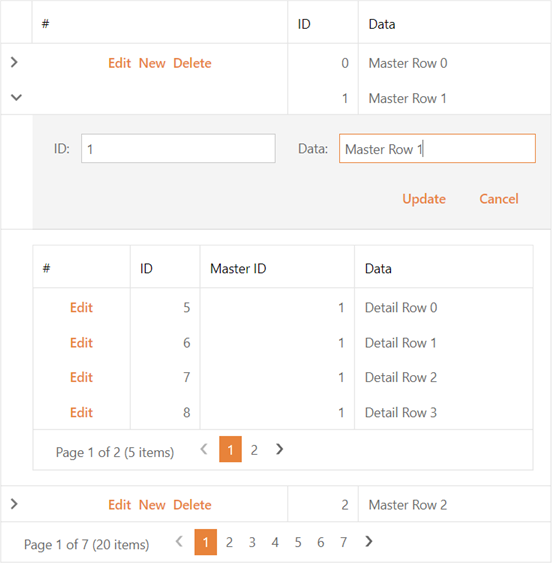

<!-- default badges list -->

<!-- default badges end -->
# Grid View for ASP.NET Web Forms - How to edit an in-memory data set with a master-detail relationship

This example demonstrates how to use the [ASPxGridView](https://docs.devexpress.com/AspNet/DevExpress.Web.ASPxGridView) to edit an in-memory data set with a master-detail relationship.

## Implementation Details 

The example application stores data in a [DataSet](https://docs.microsoft.com/en-us/dotnet/api/system.data.dataset?view=net-6.0) object created at runtime. The `DataSet` object contains master and detail data tables.

To implement the CRUD operations required to edit the grid's data, handle the following events:

- [RowInserting](https://docs.devexpress.com/AspNet/DevExpress.Web.ASPxGridView.RowInserting) 
- [RowUpdating](https://docs.devexpress.com/AspNet/DevExpress.Web.ASPxGridView.RowUpdating)
- [RowDeleting](https://docs.devexpress.com/AspNet/DevExpress.Web.ASPxGridView.RowDeleting)

## Files to Look At

- [Default.aspx](./CS/WebApp/Default.aspx) (VB: [Default.aspx](./VB/WebApp/Default.aspx))
- [Default.aspx.cs](./CS/WebApp/Default.aspx.cs) (VB: [Default.aspx.vb](./VB/WebApp/Default.aspx.vb))

## Documentation

- [Edit Data](https://docs.devexpress.com/AspNet/3712/components/grid-view/concepts/edit-data)
- [Troubleshooting: Why the 'Specified method is not supported' and 'Updating is not supported by data source 'X' unless UpdateCommand is specified' errors occur](https://docs.devexpress.com/AspNet/403771/troubleshooting/grid-related-issues/crud-operations-with-custom-data-source)

## More Examples
- [Grid View for ASP.NET Web Forms - Prevent the cell edit action on the client in batch edit mode](https://github.com/DevExpress-Examples/aspxgridview-prevent-batch-edit-action)
- [Grid View for ASP.NET Web Forms - A simple batch editing implementation](https://github.com/DevExpress-Examples/aspxgridview-simple-batch-editing-implementation)
- [Grid View for ASP.NET Web Forms - How to edit a DataTable stored in ViewState at runtime](https://github.com/DevExpress-Examples/how-to-edit-data-in-a-datatable-using-aspxgridview-at-runtime-when-data-is-stored-in-viewsta-e2945)
